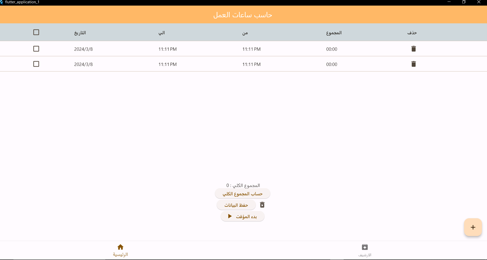

# Hasab | حاسب

 

A Flutter application that helps employees log their working hours and calculates the total hours. The program also allows users to utilize a timer to track the total number of hours during the current day.

## Mobile

 

<a href='output/hasab-android.apk'>Download for android</a>

## Windows

 

<a href='output/hasab-windows.rar' >Download for Windows</a>
